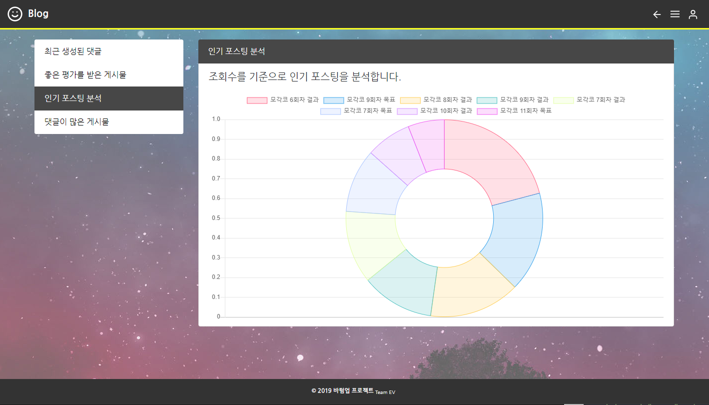

<h2>Outline</h2>
ev-commentService는 Jekyll 기반의 블로그에 댓글 서비스를 쉽게 추가할 수 있도록 하기 위해 만든 댓글 컴포넌트와 해당 사이트에 달린 댓글들에 대한 분석 기능을 제공한다.

사이트에서 제공하는 분석 기능은 '최근 생성된 댓글', '좋은 평가를 받은 게시물', '인기 포스팅 분석', '댓글이 많은 게시물' 이다.


<h2>Asset</h2>

프로젝트에 사용된 svg 아이콘은 모두 아래 페이지에서 다운로드해 사용한 것이다.

https://feathericons.com


<h2>Development Environment</h2>

>xampp for windows 7.1.30, xampp control panel 3.2.4
>
>Apache 2.4.39
>
>MariaDB 10.3.16 (MySQL)
>
>phpMyAdmin 4.9.0.1
>
>Bootstrap 4.3.1, popper.js, mdb.js, chart.js
>
>JQuery 3.2.1
>
>Ruby Sass 3.7.4

백엔드는 모두 php를 사용해 작성했고, DB는 mySQL을 사용했다.

evcommentservice.ga 홈페이지엔 모바일 환경에서도 용이하게 사용할 수 있도록 Bootstrap을 적용했다.

그 외 도메인 임대는 freenom (https://www.freenom.com/en/index.html?lang=en),  

https 프로토콜 등록은 cloudFlare (https://jsdev.kr/t/https-cloudflare-flexible-ssl/1973) 를 이용했다.


<h2>How to Use</h2>
Jekyll-Script.html은 Github Page 등 지킬 기반의 블로그에서 쉽게 댓글 서비스를 추가할 수 있도록 만든 컴포넌트 파일이다.  

지킬 기반의 블로그에서 URL을 서비스에 등록하고 사용하는 절차는 아래와 같다.

```
1 - https://evcommentservice.ga에 가입하고, + 버튼을 클릭해, 서비스를 사용할 홈페이지의 URL을 등록한다.  
URL을 등록할 때 https:{domain}.ga 처럼 등록해야 하고, 뒤에 / 가 붙으면 안 되는 것에 주의.

2 - _config.yml (프로젝트 설정 파일) 에 아래와 같은 설정을 추가한다. User ID는 위에서 가입한 홈페이지의 ID를 등록한다.

ev_username: {User ID}

3 - EV-Script.html 파일을 post layout 또는 원하는 페이지에 추가한다.
(를 추가하거나 직접 스크립트 내용을 붙여넣는다.)

4 - 댓글 창을 넣을 공간에 div 태그를 만들고 id를 EV-Start로 설정한다.
```


블로거는 자신의 블로그 댓글 서비스에 감정 분석 서비스를 적용할 지 안 할지, 적용한다면 어떻게 스타일링 될 지를 결정할 수 있다. 사용법은 아래와 같다.  

아래 ev_mode는 디폴트 값으로, full을 갖는다.  

```
블로그 설정 파일 _config.yml 내 ev_mode에 아래 중 하나의 값을 설정한다.

ev_username: { full, binary, none, debug }

full : 댓글 내용의 부정 ~ 긍정 정도에 따라 색상을 10 단계로 나눠 적용한다.

binary : 댓글 내용에 따라 긍정, 부정, 중립 세 단계로만 나눠 스타일을 적용한다.

none : 감정 분석 결과 값을 나타내지 않는다. (감정분석 값은 서버에 저장해 놓는다.)

debug : 댓글 감정 분석 서비스를 이용하지 않는다. (값을 서버에 저장하지 않음)
```


<h2>How to Work</h2>

**서비스 등록**

evCommentService.ga에 회원가입해, 아이디를 생성하면 자신의 지킬 블로그 URL을 입력함으로써, 댓글 서비스를 등록할 수 있다.

서비스를 등록한 시점에서 등록된 URL의 해싱 값으로 새 DB를 생성하며, 이 DB에 특수한 테이블인

pageTitlePairs와 visitorCounter를 생성해둔다.


**클라이언트 블로그에서 PHP 서버에 댓글 데이터를 불러오는 과정**

프론트는 Jekyll 기반의 블로그라고 가정한다. 클라이언트 (블로거)는 Jekyll-Script.js를 다운로드 받거나 복사하여, 자신의 블로그 포스트 템플릿에

인클루드 시켜야 한다. 포스트 템플릿은 site.url, page.id, page.title 값을 갖고 있다고 가정한다. (Jekyll 기반의 블로그에 모두 명시되어 있는 값)

클라이언트는 `_config.yml` 파일에 site.ev_username 속성을 명시해야 하며, ev_mode 속성을 명시해 서비스를 다른 방식으로 이용할 수도 있다.

인클루드 된 Jekyll-Script.js 파일은 등록된 블로그의 포스팅 글이 로드될 때, PHP 서버에서 script.js 파일을 내려받아, 비동기로 실행된다.

(script.js가 비동기적으로 실행되므로, iframe의 로딩은 외부 페이지 (지킬 블로그)의 로딩에 거의 영향을 주지 않고 실행된다.)

스크립트 파일을 Jekll-Script.js와 script.js 파일로 두 단계로 나눠놓은 것은, 클라이언트 측에서 사용되어야할 로직과 서버 단계에서 실행되어야

할 로직을 분리함으로써, 클라이언트 측에서의 복잡성을 낮추고 오작동을 줄이기 위해서이다. (클라이언트는 서버 측 로직인 script.js를 수정할 수 없다)

script.js 파일에선, 들어온 요청이 올바른 파라미터 값들을 갖추고 있는지 검사하고, 필수 파라미터 값이 결여되어 있다면 PHP 서버에 요청하지 않는다.

파라미터 값들이 갖춰져 있다면, PHP 서버의 URLVerification.php 파일을 ajax로 요청한다.

URLVerification.php는 DB를 탐색해 evCommentService.ga 사이트에 등록되어 있는 사이트의 요청인지를 확인한다.  

이 때 DB에 등록되어 있지 않은 사이트인 경우엔, 아래와 같은 메시지를 출력하며 서비스에 등록할 것을 권유한다.


DB에 등록되어 있는 사이트의 요청인 경우, 정당한 요청으로 판정하고, URL에 해당하는 DB에서 해당 서브 URL에 해당하는 테이블이 있는지 검사한다.

이 시점에서 테이블이 없는 경우 새 테이블을 만든다. 그 후, 클라이언트 측에서 실행되고 있는 script.js로 코멘트 페이지의 iframe을 전송한다.

이 iframe은 Comment.php를 참조하며, Get 방식으로 URL_ID, pageID, mode, paginationID 라는 4개의 변수 값을 넘겨준다.

Get 방식을 사용한 것은 같은 값을 통한 요청일 경우 항상 같은 출력 페이지를 보여줘야 한다는 것과, 위 4개의 변수들이 보안 상

크게 보호되어야 할 값은 아니라고 판단했기 때문이다.

4개의 값을 넘겨 받은 Comment.php는 넘겨 받은 값을 통해 DB에서 댓글 데이터를 불러와 PaginationDivision (10)개 만큼 댓글 창에 출력한다.

넘겨받은 값 중 mode를 통해 블로거가 설정한 댓글 스타일이 결정되고, 댓글에 감정 분석 값들로 스타일을 입힌다.


**댓글을 제출했을 때의 동작 과정**

클라이언트 페이지에서 누군가 댓글을 등록하면, 우선적으로 cross origin ajax를 통해 쟝고 서버로 댓글 내용을 전송한다.

쟝고 서버에선, 감정 분석 모듈이 작동되고 있으며, 이 모듈에 댓글 내용을 input으로 넣으면 감정분석 결과값이 반환되어 클라이언트 페이지로 전송된다.

클라이언트 페이지에선 이 값이 되돌아 오기를 기다리고 있다가, 값을 받으면 PHP 서버의 AddComment.php에 다시 ajax로 데이터를 전송한다.

AddComment.php는 PHP 서버에 감정 분석 결과 및 댓글 데이터를 저장하며, AddComment.php가 정상적으로 실행을 마치고, 클라이언트 홈페이지의

comment.js에 성공했음을 알리면, 페이지를 리로드 한다. 이 땐, iframe 내부가 리로드 되는 것으로, 외부 페이지는 리로드 되지 않는다.

comment.php가 리로드 되면, (새로 등록한 댓글이) 업데이트 된 DB에서 다시 PaginationDivision (10)개의 댓글이 최근 등록된 순으로 출력되게 된다.


**댓글의 수정 및 삭제**

댓글의 수정 및 삭제는, 댓글을 제출한 본인의 ID로 로그인 되어 있는 경우에만 가능하다. 댓글을 수정하면, 다시 쟝고 서버로 데이터를 보내

감정분석 값을 다시 받아오게 되므로, 감정 분석 결과 값 역시 갱신되고, 댓글의 스타일도 업데이트 된다.


**간단한 통계 서비스의 동작 과정**

evCommentService.ga에선, 자신의 블로그를 서비스에 등록하는 것 외에 간단한 통계 서비스를 제공하는데, 통계 서비스를 제공하기 위해,

각 서비스 DB 내에 특수한 테이블을 두 개씩 갖고 있다.


하나는, 각 페이지의 제목에 해당하는 MEDIUMTEXT 형식의 값들을 저장하는 pageTitlePairs 테이블이다. 이 테이블은 '최근 등록된 댓글' 서비스가 실행될 때,

이용되는데, 최근 등록된 댓글 이외에 이 댓글이 등록된 글 제목을 나타내기 위해 따로 페이지의 제목을 저장해 둔 테이블이다.

각 포스팅 글에 해당하는 테이블들에 컬럼 형태로 제목을 저장하지 않고 따로 위 같은 테이블을 만든 이유는, 댓글이 달릴 때 마다 전부 같은 제목을 저장하게

되는 비효율성을 피하기 위해서이다.

또 하나는, visitorCounter 테이블이다. evCommentService.ga는 조회수를 기준으로 인기 포스팅을 분석할 수 있게 해주는 서비스를 제공하는데,

이 때 포스팅 별 조회수를 기록할 테이블이 필요하다. 마찬가지로, 포스팅의 댓글마다 데이터를 기록하기엔 적절하지 않으므로, 별도의 테이블을 만든 것이다.

## Screen Shots

* 로그인 화면

<br>

* 회원가입 화면

<br>

* 정보 수정

<br>

* 차트를 통한 분석 서비스

<br>

* 서비스 추가

<br>

* 서비스 홈페이지

