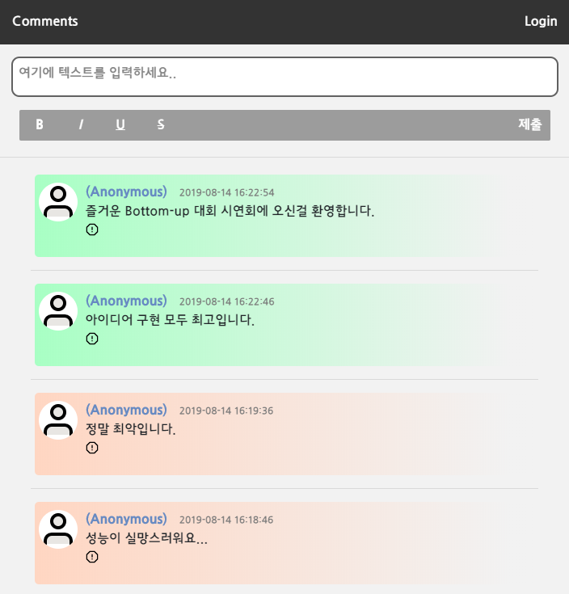

<h1 align="center">
    <a href="https://ev-commentService.ga">
    Emotion Visualization Comment Service
  </a>
</h1>

<p align="center">
  <strong>ⓒ Team EV</strong><br>
  2019 BottomUp<br>
  이세형, 이규봉, 최수민
</p>

<p align="center">
    
</p>

<p align="center">
    
</p>

## 📋 Purpose

#### **감성분석을 이용해 글의 감성을 색으로 표현 (시각화)**

코멘트에 대해 감성분석을 하여 긍정 및 부정에 대한 정도를 색으로 표현함으로써<br/>아래와 같은 효과를 기대할 수 있다.

- 악성 댓글 작성자들에게 자신이 쓴 글에 대한 경각심을 줄 수 있다.
- 단순 평점 리뷰 같은 경우, 감성의 정보를 추가하여 리뷰에 대한 신뢰성을 보강 할 수 있다.
- 유아, 아동용 플랫폼에 적용 시 교육용으로 활용 할 수 있다.

## ⛷️ Outline

CNU-EV는 감정 분석 기능을 제공하는 댓글 컴포넌트 서비스를 제공하기 위해 구성된 3개의 프로젝트입니다.

- [**ev-commentService**][a] :  지킬형 블로그에 댓글을 달 수 있게 컴포넌트 스크립트를 제공합니다. 그 외 '최근 생성된 댓글', '좋은 평가를 받은 게시물', '인기 포스팅 분석', '댓글이 많은 게시물' 서비스를 제공합니다.

- [**ev-backend**][b] : 분석사이트를 제작하는 Team-Ev의 backend repository 입니다. Django를 기반으로 제작되었으며, konlpy와 tensorflow 를 기반으로 하는 감정분석 판별기를 포함합니다.

- [**ev-sentimentalAnalysis**][c] : 쟝고 서버 내 댓글 감정 분석 모듈입니다.

[a]: https://github.com/cnu-ev/ev-commentService
[b]: https://github.com/cnu-ev/ev-backend
[c]: https://github.com/cnu-ev/ev-sentiment_analysis


## 📋 Asset

프로젝트에 사용된 svg 아이콘은 모두 아래 페이지에서 다운로드해 사용한 것이다.

https://feathericons.com


##  ✔️ Development Environment Details

```
##### Front, PHP Server #####
xampp for windows 7.1.30, xampp control panel 3.2.4
Apache 2.4.39
MariaDB 10.3.16 (MySQL)
phpMyAdmin 4.9.0.1
Bootstrap 4.3.1, popper.js, mdb.js, chart.js
JQuery 3.2.1
Ruby Sass 3.7.4

##### Emotion Analasis Djanjo Server #####
absl-py==0.7.1
astor==0.8.0
boto==2.49.0
boto3==1.9.194
botocore==1.12.194
certifi==2019.6.16
chardet==3.0.4
Django==2.0.13
django-cors-headers==3.0.2
docutils==0.14
gast==0.2.2
gensim==3.8.0
google-pasta==0.1.7
grpcio==1.22.0
h5py==2.9.0
idna==2.8
jmespath==0.9.4
joblib==0.13.2
JPype1==0.7.0
Keras-Applications==1.0.8
Keras-Preprocessing==1.1.0
konlpy==0.5.1
Markdown==3.1.1
mecab-python==0.996
numpy==1.16.4
pkg-resources==0.0.0
protobuf==3.9.0
pybind11==2.3.0
python-dateutil==2.8.0
pytz==2019.1
requests==2.22.0
s3transfer==0.2.1
scikit-learn==0.21.2
scipy==1.3.0
six==1.12.0
smart-open==1.8.4
tensorboard==1.14.0
tensorflow==1.14.0
tensorflow-estimator==1.14.0
termcolor==1.1.0
urllib3==1.25.3
uWSGI==2.0.18
Werkzeug==0.15.5
wrapt==1.11.2
```

백엔드는 php 서버 (evCommentService.ga) 와 쟝고 서버  (emotionanalysisservice.ga) 로 구성되어 있다.

evcommentservice.ga 홈페이지 및 `Comment.php`엔 모바일 환경에서도 용이하게 사용할 수 있도록 Bootstrap을 적용했다.

그 외 도메인 임대는 freenom (https://www.freenom.com/en/index.html?lang=en),  

https 프로토콜 등록은 cloudFlare (https://jsdev.kr/t/https-cloudflare-flexible-ssl/1973) 를 이용했다.


## 🏄 How to use

`Jekyll-Script.html`은 Github Page 등 지킬 기반의 블로그에서 쉽게 댓글 서비스를 추가할 수 있도록 만든 컴포넌트 파일이다.  

지킬 기반의 블로그에서 URL을 서비스에 등록하고 사용하는 절차는 아래와 같다.

```
1 - https://evcommentservice.ga에 가입하고, + 버튼을 클릭해, 서비스를 사용할 홈페이지의 URL을 등록한다.  
URL을 등록할 때 https:{domain}.ga 처럼 등록해야 하고, 뒤에 / 가 붙으면 안 되는 것에 주의.

2 - _config.yml (프로젝트 설정 파일) 에 아래와 같은 설정을 추가한다. User ID는 위에서 가입한 홈페이지의 ID를 등록한다.

ev_username: {User ID}

3 - EV-Script.html 파일을 post layout 또는 원하는 페이지에 추가한다.
(를 추가하거나 직접 스크립트 내용을 붙여넣는다.)

4 - 댓글 창을 넣을 공간에 div 태그를 만들고 id를 EV-Start로 설정한다.
```


블로거는 자신의 블로그 댓글 서비스에 감정 분석 서비스를 적용할 지 안 할지, 적용한다면 어떻게 스타일링 될 지를 결정할 수 있다. 사용법은 아래와 같다.  

아래 ev_mode는 디폴트 값으로, full을 갖는다.  

```
블로그 설정 파일 _config.yml 내 ev_mode에 아래 중 하나의 값을 설정한다.

ev_username: { full, binary, none, debug }

full : 댓글 내용의 부정 ~ 긍정 정도에 따라 색상을 10 단계로 나눠 적용한다.

binary : 댓글 내용에 따라 긍정, 부정, 중립 세 단계로만 나눠 스타일을 적용한다.

none : 감정 분석 결과 값을 나타내지 않는다. (감정분석 값은 서버에 저장해 놓는다.)

debug : 댓글 감정 분석 서비스를 이용하지 않는다. (값을 서버에 저장하지 않음)
```


## 📖 How to evaluate comment


입력데이터(문장) -> 전처리된 문장 -> 벡터로 임베딩 -> 모델에 따른 감성분석 결과


* 전처리 - 형태소 분석(태깅)

  Konlpy - Mecab 사용

  

* 단어 임베딩

  1.word2vec

  
  from : https://becominghuman.ai/how-does-word2vecs-skip-gram-work-f92e0525def4

  **Word2Vec**은 중심단어와 주변단어 벡터의 내적이 코사인 유사도가 되도록 단어벡터를 벡터공간에 임베딩.<br/>
  중심단어에 해당하는 벡터와 주변단어에 해당하는 벡터의 내적값을 높이는 방식으로 임베딩을 한다.<br/>벡터 내적은 코사인이므로 내적값 상향은 단어벡터 간 유사도를 높인다<br/>

  2.Glove

  
  from : https://nlp.stanford.edu/projects/glove/

  **GloVe**은 임베딩된 두 단어벡터의 내적이 말뭉치 전체에서의 동시 등장확률 로그값이 되도록 목적함수를 정의<br/>
  임베딩된 단어벡터 간 유사도 측정을 수월하게 하면서도 말뭉치 전체의 통계 정보를 좀 더 잘 반영하도록 한다.<br/>
  임베딩 된 중심 단어와 주변 단어 벡터의 내적이 전체 코퍼스에서의 동시 등장 확률이 되도록 만드는 방법.<br/>

  

* 학습모델

  - Logistic Regression (Multi Layer Neural Network)

  - LSTM+Attension (Recurrent Neural Network)

## 📉 Performance evaluation

**두 방법의 성능 차이**

75000개의 test set에 대해서

<p align="center">

</p>

```
		Glove_ACC 	= 0.8672    				Word2Vec_ACC = 0.8509
		Glove_SN 	= 0.8458    				Word2Vec_SN = 0.8271
		Glove_PREC 	= 0.8847    				Word2Vec_PREC = 0.8697
		Glove_SP 	= 0.8888    				Word2Vec_SP = 0.8749
```

<p align="center">												

</p>

```
		Glove_ERR = 0.1327     					Word2Vec_ERR = 0.1483
		Glove_FPR = 0.1111    					Word2Vec_FPR = 0.1250
```

## ❗ How to Work

* **회원가입, 로그인, 로그아웃, 정보변경**

evCommentService.ga에 회원가입할 땐 필수 입력 값으로 ID, PW, PW 확인을 입력해야 한다. 그 외 선택 입력 값으로 성별, 이름 (성, 이름), 이메일 주소, 주소, 핸드폰 번호를 입력할 수 있으며, 아이디, 이메일, 핸드폰 번호는 정규식을 통해 알맞은 값인지를 검사한다.

그 외 원하는 프로필 사진을 업로드해 등록할 수 있다. 프로필 사진으로 업로드 가능한 파일은 `png, jpg, jpeg`이다.

입력한 정보와 업로드된 프로필 사진은 PHP 서버에 저장되며, 정보 변경 페이지에서 변경할 수 있다.

정보 변경 페이지에서 프로필 사진을 다시 업로드하면 기존의 프로필 사진 파일은 지워지고, 새로 업로드된 이미지를 사용하게 된다.

업로드된 프로필 사진은 `Comment.php`에서 제출한 댓글에 표시된다.

로그인, 로그아웃은 세션을 사용해 구현했다.

<br>

* 로그인 화면

<br>

* 회원가입 화면

<br>

* 정보 수정

<br>


<hr>

* **서비스 등록 및 삭제**

evCommentService.ga에 회원가입해, 아이디를 생성하면 자신의 지킬 블로그 URL을 입력함으로써, 댓글 서비스를 등록할 수 있다.

서비스를 등록한 시점에서 등록된 URL의 해싱 값으로 새 DB를 생성하며, 이 DB에 특수한 테이블인

pageTitlePairs와 visitorCounter를 생성해둔다.

서비스를 제거하면 등록해놓은 DB를 제거함으로써, 그 안의 댓글 데이터를 담고 있는 테이블도 모두 제거된다.

* 서비스 추가

<br>

* 서비스 홈페이지


<hr>

* **클라이언트 블로그에서 PHP 서버에 댓글 데이터를 불러오는 과정**

프론트는 Jekyll 기반의 블로그라고 가정한다. 클라이언트 (블로거)는 `Jekyll-Script.html`를 다운로드 받거나 복사하여, 자신의 블로그 포스트 템플릿에 인클루드 시켜야 한다. 포스트 템플릿은 site.url, page.id, page.title 값을 갖고 있다고 가정한다. (Jekyll 기반의 블로그에 모두 명시되어 있는 값)

클라이언트는 `_config.yml` 파일에 site.ev_username 속성을 명시해야 하며, ev_mode 속성을 명시해 서비스를 다른 방식으로 이용할 수도 있다.

인클루드 된 `Jekyll-Script.js` 파일은 등록된 블로그의 포스팅 글이 로드될 때, PHP 서버에서 script.js 파일을 내려받아, 비동기로 실행한다.

(script.js를 async로 실행하는 이유는, iframe의 로딩은 외부 페이지 (지킬 블로그)의 로딩에 거의 영향을 주지 않고 실행하기 위해서이다.)

스크립트 파일을 `Jekll-Script.js`와 `script.js` 파일로 두 단계로 나눠놓은 것은, 클라이언트 측에서 사용되어야할 로직과 서버 단계에서 실행되어야 할 로직을 분리함으로써, 클라이언트 측에서의 복잡성을 낮추고 오작동을 줄이기 위해서이다. (클라이언트는 서버 측 로직인 `script.js`를 수정할 수 없다)

script.js 파일에선, 들어온 요청이 올바른 파라미터 값들을 갖추고 있는지 검사하고, 필수 파라미터 값이 결여되어 있다면 PHP 서버에 요청하지 않는다. 파라미터 값들이 갖춰져 있다면, PHP 서버의 `URLVerification.php` 파일을 ajax로 요청한다.

`URLVerification.php`는 DB를 탐색해 evCommentService.ga 사이트에 등록되어 있는 사이트의 요청인지를 확인한다.  이 때 DB에 등록되어 있지 않은 사이트인 경우엔, 아래와 같은 메시지를 출력하며 서비스에 등록할 것을 권유한다.

<p align="center">

</p>

DB에 등록되어 있는 사이트의 요청인 경우, 정당한 요청으로 판정하고, URL에 해당하는 DB에서 해당 서브 URL에 해당하는 테이블이 있는지 검사한다. 이 시점에서 테이블이 없는 경우 새 테이블을 만든다. 그 후, 클라이언트 측에서 실행되고 있는 `script.js`로 코멘트 페이지의 iframe을 전송한다.

이 iframe은 `Comment.php`를 참조하며, Get 방식으로 URL_ID, pageID, mode, paginationID 라는 4개의 변수 값을 넘겨준다.

Get 방식을 사용한 것은 같은 값을 통한 요청일 경우 항상 같은 출력 페이지를 보여줘야 한다는 것과, 위 4개의 변수들이 보안 상

크게 보호되어야 할 값은 아니라고 판단했기 때문이다.

4개의 값을 넘겨 받은 `Comment.php`는 넘겨 받은 값을 통해 DB에서 댓글 데이터를 불러와 PaginationDivision (10)개 만큼 댓글 창에 출력한다.

넘겨받은 값 중 mode를 통해 블로거가 설정한 댓글 스타일이 결정되고, 댓글에 감정 분석 값들로 스타일을 입힌다.


- full


<p align="center">

</p>


- binary

<p align="center">

</p>


- none, debug

<p align="center">

</p>


테이블에 댓글이 없다면 등록된 댓글이 없다는 메시지를 출력한다.


<p align="center">

</p>


<hr>

* **댓글을 제출했을 때의 동작 과정**

로그인 되어 있지 않은 상태에서 댓글 제출 버튼을 클릭하면 우선 아래처럼 evCommentService.ga에 가입을 권유하는 메시지를 띄워 나타낸다.

<p align="center">

</p>

그 상태에서 제출 버튼을 한 번 더 클릭하면 익명으로 댓글을 제출할 수 있다. 로그인 된 상태에서 제출한 댓글은 위와 같은 과정을 거치지 않는다.

클라이언트 페이지에서 누군가 댓글을 등록하면, 우선적으로 cross origin ajax를 통해 쟝고 서버로 댓글 내용을 전송한다.

쟝고 서버에선, 감정 분석 모듈이 작동되고 있으며, 이 모듈에 댓글 내용을 input으로 넣으면 감정분석 결과값이 반환되어 클라이언트 페이지로 전송된다.

클라이언트 페이지에선 이 값이 되돌아 오기를 기다리고 있다가, 값을 받으면 PHP 서버의 `AddComment.php`에 다시 ajax로 데이터를 전송한다.

`AddComment.php`는 PHP 서버에 감정 분석 결과 및 댓글 데이터를 저장하며, `AddComment.php`가 정상적으로 실행을 마치고, 클라이언트 홈페이지의

`comment.js`에 성공했음을 알리면, 페이지를 리로드 한다. 이 땐, iframe 내부가 리로드 되는 것으로, 외부 페이지는 리로드 되지 않는다.

`comment.php`가 리로드 되면, (새로 등록한 댓글이) 업데이트 된 DB에서 다시 PaginationDivision (10)개의 댓글이 최근 등록된 순으로 출력되게 된다.

<hr>

* **댓글의 수정 및 삭제**

댓글의 수정 및 삭제는, 댓글을 제출했던 본인의 ID로 로그인 되어 있는 경우에만 가능하다. 댓글을 수정하면, 다시 쟝고 서버로 데이터를 보내

감정분석 값을 다시 받아오게 되므로, 감정 분석 결과 값 역시 갱신되고, 댓글의 스타일도 업데이트 된다.


<p align="center">

</p>


<hr>

* **감정분석 값 리포트**

댓글에 사용된 감정분석 값이 적절하지 않다고 생각되는 경우, 어떤 유저라도 리포트 버튼을 눌러 쟝고 서버로 적절하지 않은 데이터라는

메시지를 보낼 수 있다. 이 버튼은 evMode가 none일 땐 표시되지 않는다.

<p align="center">

</p>


<hr>

* **간단한 통계 서비스의 동작 과정**

evCommentService.ga에선, 자신의 블로그를 서비스에 등록하는 것 외에 간단한 통계 서비스를 제공하는데, 통계 서비스를 제공하기 위해,

각 서비스 DB 내에 특수한 테이블을 두 개씩 갖고 있다.

하나는, 각 페이지의 제목에 해당하는 MEDIUMTEXT 형식의 값들을 저장하는 pageTitlePairs 테이블이다. 이 테이블은 '최근 등록된 댓글' 서비스가 실행될 때,

이용되는데, 최근 등록된 댓글 이외에 이 댓글이 등록된 글 제목을 나타내기 위해 따로 페이지의 제목을 저장해 둔 테이블이다.

각 포스팅 글에 해당하는 테이블들에 컬럼 형태로 제목을 저장하지 않고 따로 위 같은 테이블을 만든 이유는, 댓글이 달릴 때 마다 전부 같은 제목을 저장하게

되는 비효율성을 피하기 위해서이다.

또 하나는, visitorCounter 테이블이다. evCommentService.ga는 조회수를 기준으로 인기 포스팅을 분석할 수 있게 해주는 서비스를 제공하는데,

이 때 포스팅 별 조회수를 기록할 테이블이 필요하다. 마찬가지로, 포스팅의 댓글마다 데이터를 기록하기엔 적절하지 않으므로, 별도의 테이블을 만든 것이다.

4개의 통계 서비스는 `CommentManageService.php`에서 왼쪽 4개의 버튼을 누름으로써, ServiceSection에 ajax로 로드되는 형태로 나타난다.

각각의 통계 서비스는 '날짜', '감정분석 값의 평균', '조회 수', '댓글 수' 를 가중치로 하는 우선순위 큐를 사용하여, 목표로 하는 데이터를 추출하고,

chart.js의 차트로 나타낸 후 `CommentManageService.php`에 echo 한다.


- 좋은 평가를 받은 게시물

<br>

- 인기 포스팅 분석

<br>

- 댓글이 많이 달린 게시글

<br>

- 최근 생성된 댓글

<br>


<hr>

* **Sass**

프로젝트를 진행하며, css에 중복되는 값들이 많이 나타나 복사, 붙여넣기 해야할 일이 많아졌다. (같은 컴포넌트를 사용하는 경우 등)

이대로는 css 코드를 보수하기 점점 어려워질 것으로 판단하여, Ruby의 Sass란 전처리기를 사용해 CSS의 재사용성을 높였다.


## ❗ Documentations

프로젝트 내 사용된 댓글 서비스 코드 파일들의 설명을 테이블로 정리했습니다.

* **PHP Files**

| File Name | Description |
|---|---|
| AddComment.php | 댓글을 제출할 때 Ajax로 호출되어, 감정분석 값을 포함한 댓글 데이터를 DB에 저장합니다. |
| CommentPageLogin.php | Comment.php에서 로그인할 때 ajax로 호출합니다. evCommentService.ga에서 로그인 할 땐 SignInAction.php를 사용합니다. |
| CommentPageLogout.php | Comment.php에서 로그아웃 할 때 사용합니다. 세션을 삭제하는 식으로 작동합니다. |
| DeleteComment.php | 댓글을 삭제하는 버튼을 클릭했을 때, 실행됩니다. 인자로 넘어온 UserID 값이 지우려 하는 댓글의 ID와 같다면 DB에서 댓글을 지웁니다. |
| DeleteService.php | evCommentService.ga에서 서비스를 삭제하는 버튼을 눌렀을 때 실행됩니다. |
| EditComment.php | 댓글을 수정하는 버튼을 눌렀을 때 실행됩니다.  |
| ID_DuplicateCheck.php | 회원가입 페이지에서 댓글 중복 검사 버튼을 눌렀을 때 실행됩니다. |
| MySQLConection.php | MySQL에 접속하기 위한 클래스인 MySQLConnection이 정의되어 있습니다. 다른 php 파일들에서 require해 사용합니다. |
| PopularPosting.php | evCommentService.ga에서 블로그에서 '인기 포스팅 분석' 서비스를 제공합니다. |
| Positiveness.php | evCommentService.ga에서 블로그에서 '좋은 평가를 받은 게시물' 서비스를 제공합니다. |
| PostsSortingByCommentsNumber.php | evCommentService.ga에서 블로그에서 '댓글이 많이 달린 게시물' 서비스를 제공합니다. |
| RecentComments.php | evCommentService.ga에서 블로그에서 '최근 달린 댓글' 서비스를 제공합니다. |
| RegisterURL.php | evCommentService.ga에서 서비스를 등록하려 시도할 때 실행됩니다.  요청으로 들어온 URL 값을 해싱해 DB를 생성하고, 특수한 두 개의 테이블인 pageTitlePairs, VisitorCounter 을 만듭니다. |
| ShowHomePage.php | evCommentService.ga에서 등록된 홈페이지를 나타내는 함수들을 갖고 있는 php 파일입니다. |
| SignInAction.php | evCommentService.ga에서 로그인할 때 실행됩니다. |
| SignOutAction.php | evCommentService.ga에서 로그아웃 할 때 실행됩니다. |
| SignUpAction.php | evCommentService.ga에 회원가입할 때 실행됩니다. |
| URLVerification.php | 클라이언트 페이지에서 댓글 페이지를 요청할 때 실행됩니다. |
| UserEditAction.php | evCommentService.ga에서 회원정보를 변경할 때 실행됩니다. |
| UserModalBox.php | 유저의 정보를 보여주는 ModalBox를 나타내는 함수가 정의되어 있습니다. Comment.php와 evCommentService.ga 홈페이지에서 모두 이용합니다. |
| CommentManageService.php | evCommentService.ga에서 블로그에 대한 간단한 통계 서비스를 제공합니다. |
| SignIn.php | evCommentService.ga의 로그인 페이지입니다. |
| Register.php | evCommentService.ga의 서비스 등록 및 관리 페이지입니다. |
| UserEdit.php | evCommentService.ga의 회원 정보 수정 페이지입니다. |
| index.html | evCommentService.ga의 index.html의 기본 동작은 로그인 페이지로 이동하는 것입니다. |
| SignUp.html | evCommentService.ga의 회원 가입 페이지 입니다. |
| CommentExample.html | 댓글 창 스타일을 확인하기 위한 예제 파일입니다. |
| Script.html | 클라이언트가 서비스를 이용하기 위해 사용해야 하는 스크립트 파일입니다. |


* **JS Files**

| File Name | Description |
|---|---|
| comment.js | comment.php에서 서버와 데이터를 주고 받는데 사용합니다. 그 외 댓글에 스타일을 주는 기능을 포함합니다.  |
| CommentManageService.js | evCommentService.ga에서 블로그 통계를 제공하기 위해 사용됩니다. |
| SignIn.js | evCommentService.ga의 로그인에 사용됩니다. |
| SignUp.js | evCommentService.ga의 회원가입에 사용됩니다.  정규식을 통한 유효성 검사 및 프로필 사진 변경에 대한 코드를 포함합니다. |
| URL-Register.js | evCommentService.ga의 블로그 서비스 등록 및 관리에 사용됩니다. |
| UserEdit.js | evCommentService.ga의 유저 정보 변경에 사용됩니다. |

* **Sass Files**

| File Name | Description |
|---|---|
| BackGround.scss | evcommentService.ga의 배경에 대한 스타일 시트입니다. |
| BottomFixedNavbar.scss | evcommentService.ga의 화면 하단에 고정된 NavBar의 스타일 시트 입니다. |
| comment.scss | comment.php에서 사용하는 스타일 시트 입니다. |
| CommentManageService.scss | evcommentService.ga의 블로그 통계 서비스에 사용된 스타일 시트입니다. |
| Style.scss | comment.php에서 사용하는, 감정분석 값에 따른 색상을 나열한 스타일 시트입니다. |
| RegisterURL.scss | evcommentService.ga에서 URL 등록 페이지에 사용하는 스타일 시트입니다. |
| SignIn.scss | evcommentService.ga의 로그인 페이지에 사용된 스타일 시트입니다. |
| SignUp.scss | evcommentService.ga의 회원가입 페이지에 사용된 스타일 시트입니다. |
| TopNavbar.scss | evcommentService.ga의 화면 상단에 고정된 TopNavBar의 스타일 시트입니다. |
| UserEdit.scss | evcommentService.ga의 유저 정보 변경에 사용된 스타일 시트입니다. |

